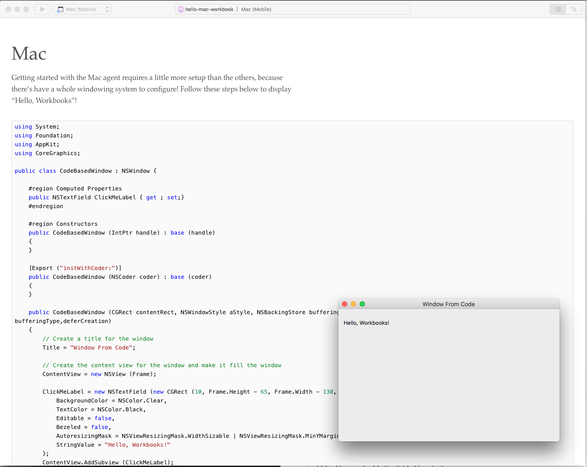

Getting Started
============

This section covers the techniques required to get started with Xamarin.Mac based workbooks.

## Hello, Mac Workbook

Getting started with the Mac agent requires a little more setup than the others, because there’s have a whole windowing system to configure. Follow these steps in this workbook to display “Hello, Workbooks” window.

