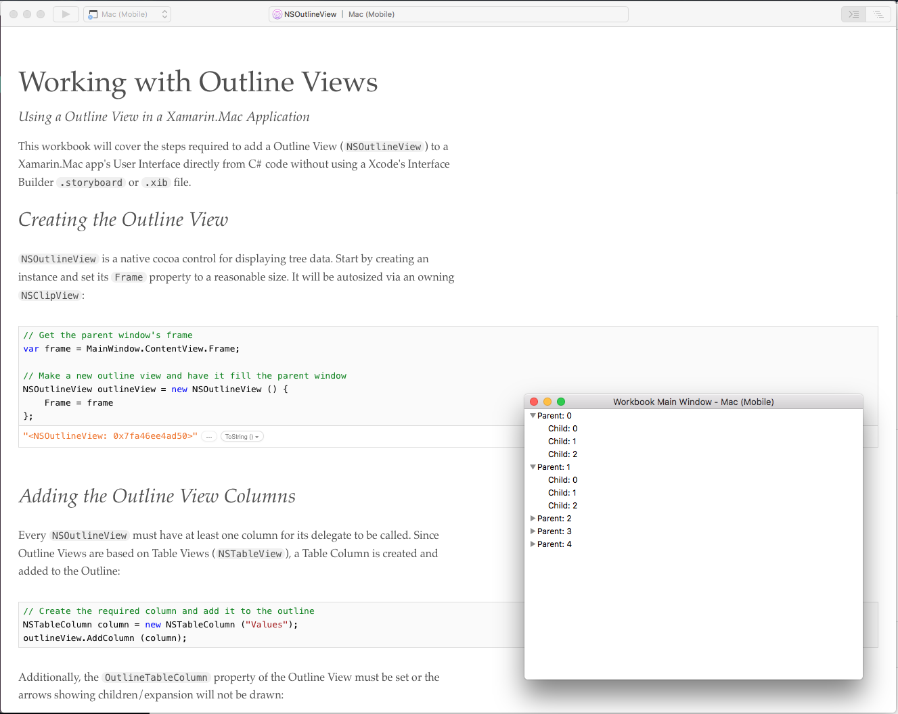
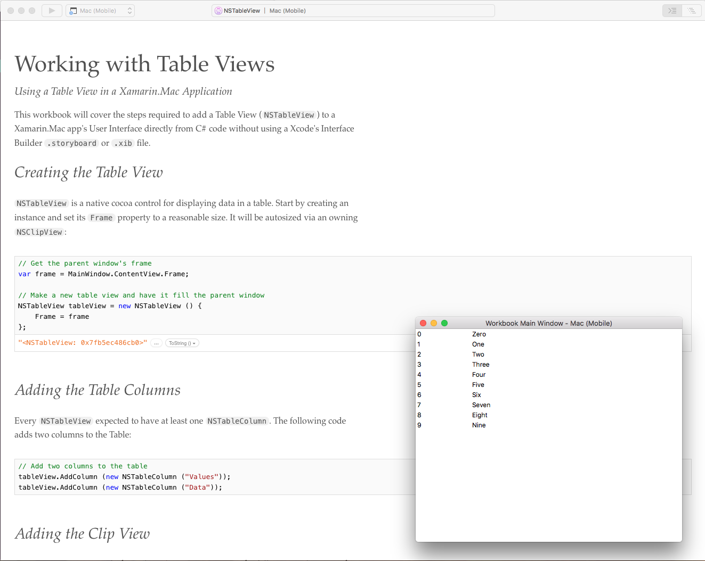
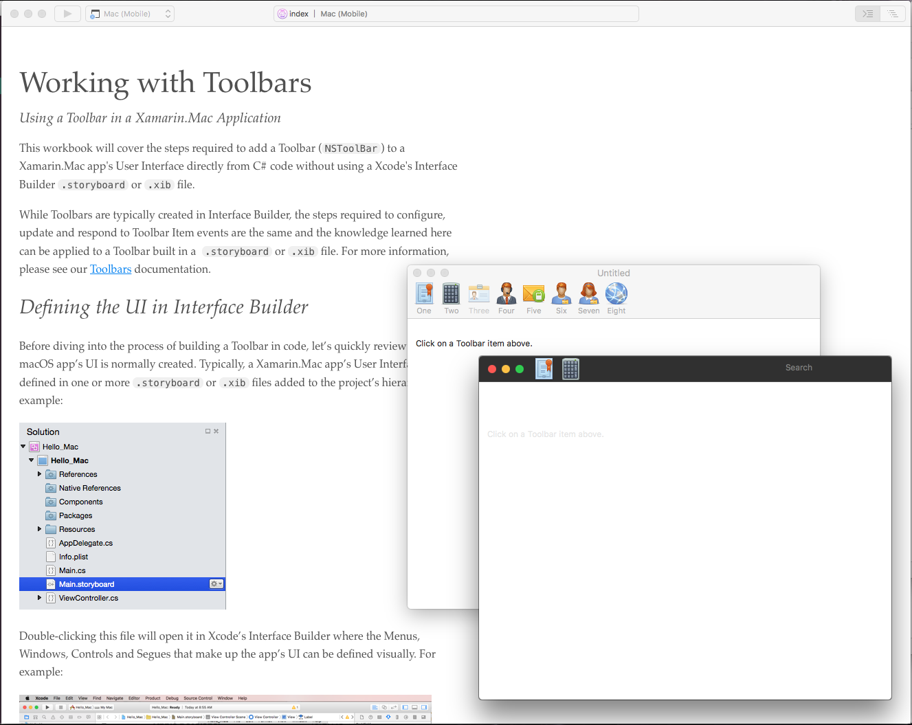
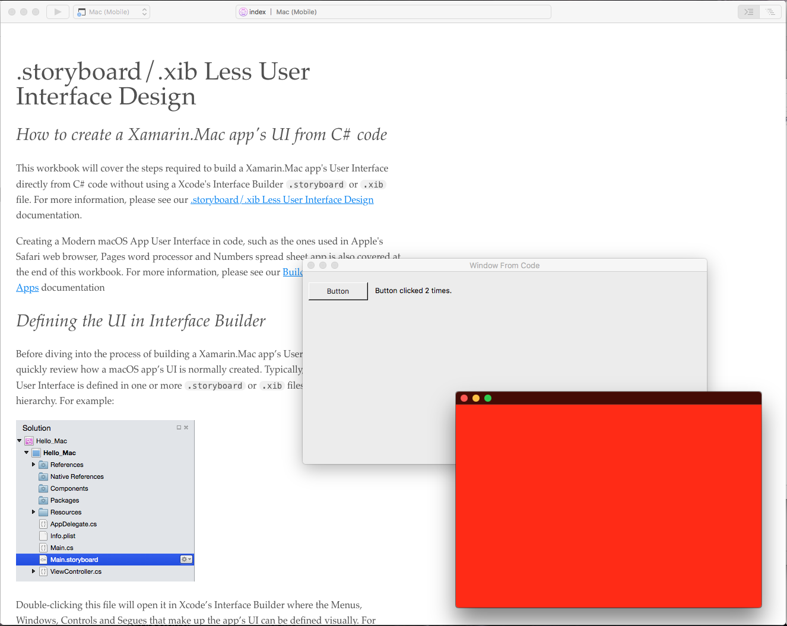
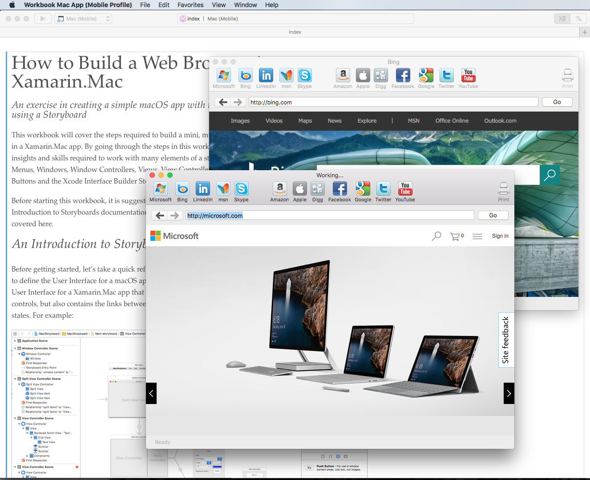

# Xamarin.Mac User Interface Workbooks

The workbooks in this section cover many of the common elements used to create a Xamarin.Mac app's User Interface such as Windows, Toolbars and Table Views.

Because of the way workbooks function, many of the workbooks in this section will cover the steps required to build a Xamarin.Mac app's User Interface directly from C# code without using a Xcode's Interface Builder `.storyboard` or `.xib` file.

<!--## Defining a UI in Interface Builder

Before diving into the process of building a Xamarin.Mac app’s User Interface in code, let’s quickly review how a macOS app’s UI is normally created. Typically, a Xamarin.Mac app’s User Interface is defined in one or more `.storyboard` or `.xib` files added to the project’s hierarchy. For example:

Double-clicking this file will open it in Xcode’s Interface Builder where the Menus, Windows, Controls and Segues that make up the app’s UI can be defined visually. For example:

When the UI layout is completed, the graphical elements that make up the UI are then exposed via **Actions** and **Outlets**, making them accessible to code. When the developer saves their changes to the Main.storyboard file and returns to Xamarin Studio, these changes are synced with the Xamarin.Mac app’s Project File and the UI elements are then accessible in C#.-->

For more information, please see our [Hello, Mac](https://developer.xamarin.com/guides/mac/getting_started/hello,_mac/), [Introduction to Storyboards](https://developer.xamarin.com/guides/mac/platform-features/storyboards/), [Working with .xib Files](https://developer.xamarin.com/guides/mac/application_fundamentals/working-with-xibs/) and [.storyboard/.xib Less User Interface Design](https://developer.xamarin.com/guides/mac/application_fundamentals/xibless-ui/) documentation.

# Available Workbooks

The following User Interface workbooks are available for Xamarin.mac:

## [Working with Outline Views](outlineview)

This workbook will cover working with a Outline View (`NSOutlineView`) in a Xamarin.Mac app's User Interface. `NSOutlineView` is a native cocoa control for displaying tree data.

## [Working with Table Views](tableview)

This workbook will cover working with a Table View (`NSTableView`) in a Xamarin.Mac app's User Interface. `NSTableView` is a native cocoa control for displaying data in a table.

## [Working with Toolbars Workbook](toolbars)

This workbook will cover working with a Toolbar (`NSToolbar`) in a Xamarin.Mac app's User Interface. `NSToolbar` is a native cocoa control for adding a user configurable Toolbar to the top of a Window (`NSWindow`).

## [.storyboard/.xib Less User Interface Design Workbook](ui-in-code)

This workbook will cover the steps required to build a Xamarin.Mac app's User Interface directly from C# code without using a Xcode's Interface Builder `.storyboard` or `.xib` file.

## [Working with Segues in macOS Storyboard](segues)

This workbook will cover the typical uses of Segues within a Storyboard, and how they can be used to limit the amount of code a developer is required to write to present a Xamarin.Mac app’s UI.

## [How to Build a Web Browser in Xamarin.Mac](webbrowser)

This workbook will cover the steps required to build a mini, multi-windowed web browser in a Xamarin.Mac app. By going through the steps in this workbook, the reader will gain insights and skills required to work with many elements of a standard macOS app such as Menus, Windows, Window Controllers, Views, View Controllers, Toolbars, Text Field, Buttons and the Xcode Interface Builder Storyboard files used to define them.

