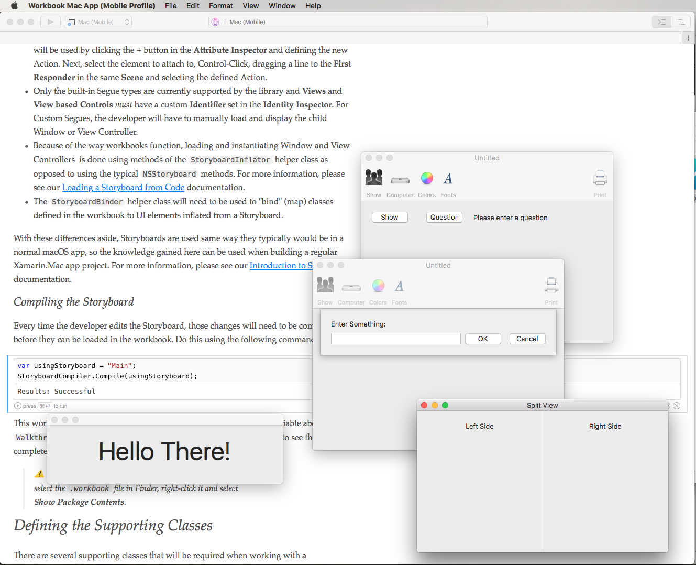

Working with Segues in macOS Storyboard
============

This workbook will cover the typical uses of Segues within a Storyboard, and how they can be used to limit the amount of code a developer is required to write to present a Xamarin.Mac app’s UI.

