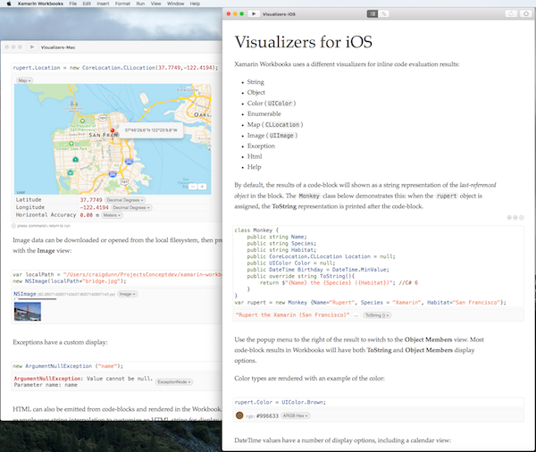

Visualizers
=========

[Xamarin Workbooks](https://developer.xamarin.com/guides/cross-platform/workbooks/) results visualization examples.

These workbooks (one for each platform) demonstrate

* String
* Object
* Color (UIColor)
* Enumerable
* Map (CLLocation)
* Image (UIImage)
* Exception
* Html
* Help

visualizations of object results.